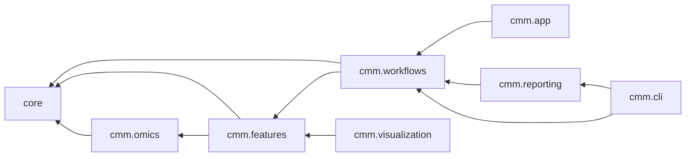

# `src/cmm` — library layout

## Purpose

`cmm` owns every numerical service. The Qt app and the CLI are thin views over the same
functions, so an analysis is never implemented twice. See
[`docs/agent-reference.md`](../docs/agent-reference.md) for signatures, and read only the
section for the call you are about to make.

| Package | Owns | Solves? |
|---|---|:---:|
| `core` | conditions, media, FBA/pFBA/FVA, `FluxState`, solver capability, provenance | yes |
| `omics` | expression → GPR → E-Flux2 / LAD, source→target directions | yes |
| `features` | MOMA/ROOM, yield, envelope, FSEOF/FVSEOF, flux response, sampling, OptKnock/RobustKnock, MTA/rMTA | yes |
| `workflows` | SC-01 `production`, SC-02 `transformation` — composition and run schema only | delegates |
| `reporting` | reads a completed run, renders R figures, validates the bundle | never |
| `visualization` | computed results → matplotlib | never |
| `app` · `cli` | Qt shell · argparse adapter | never |

## Quick commands

```bash
# verify a change (all four must pass)
QT_QPA_PLATFORM=offscreen uv run --frozen --all-extras pytest -q --cov=cmm --cov-branch --cov-fail-under=80
uv run --frozen --all-extras ruff check src tests examples
uv run --frozen --all-extras mypy src/cmm/core src/cmm/features src/cmm/omics src/cmm/workflows src/cmm/reporting
```

## Common change patterns

- **New analysis** → a solver-neutral service in `features/` or `omics/` returning a frozen
  dataclass with `to_frame()` and `run_provenance`. Export it, then add a contract in
  [`docs/VALIDATION.md`](../docs/VALIDATION.md).
- **New shipped feature** → move it from `PLANNED_FEATURES` to `INCLUDED_FEATURES`.
- **New canonical workflow** → [the tutorial](../docs/tutorials/adding-a-canonical-workflow.md);
  it needs its own schema id, renderer, validator, CLI boundary, and tests.
- **GUI change** → `app/` only. A calculation there belongs in a service instead.

## Non-obvious patterns

- **Why: `cmm.workflows.__all__` re-exports SC-01 only.** Import SC-02 from its submodule
  (`from cmm.workflows.transformation import run_transformation_target_discovery`).
- **Why: `reporting` and `visualization` never invoke a solver.** They read results that already
  exist, so a figure can never silently disagree with the run directory.
- **Note: check solver capability before the call.** GLPK is LP + MILP only; MOMA-L2, E-Flux2 and
  `rmta_continuous` need QP, MTA/rMTA need MIQP. Use `core.solver_status` / `core.supports`, and
  see [`docs/adr/0001-solver-capability-gate.md`](../docs/adr/0001-solver-capability-gate.md).
- **Note: an infeasible solve is data**, reported as `status="infeasible"` / `essential=yes`.
- **Gotcha: `FluxState` is stale** after any model, medium, bound, or expression change.

## Cross-module dependencies



Arrows point to what a package imports; nothing points back. `core` imports none of the others,
so treat `FluxState`, `TargetRanking`, and `run_provenance` as public contracts — a change there
ripples through everything above. Layer rationale: [`docs/architecture.md`](../docs/architecture.md).

## See also

- [`AGENTS.md`](../AGENTS.md) — routing, solver gate, operating rules
- [`docs/scenarios/`](../docs/scenarios/README.md) — what each workflow's numbers mean
- [`docs/adr/`](../docs/adr/README.md) — why the contested choices were made
- [`tests/CLAUDE.md`](../tests/CLAUDE.md) — how to verify a change
